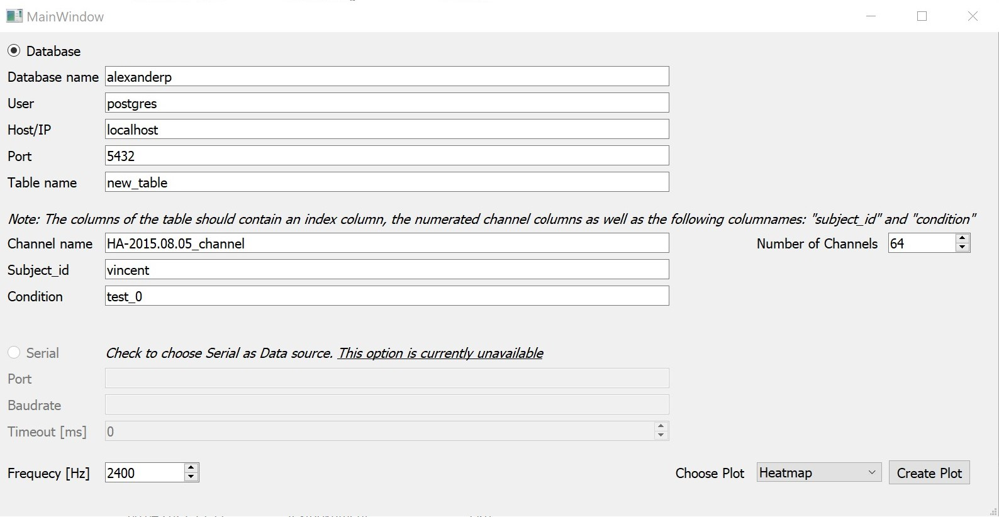
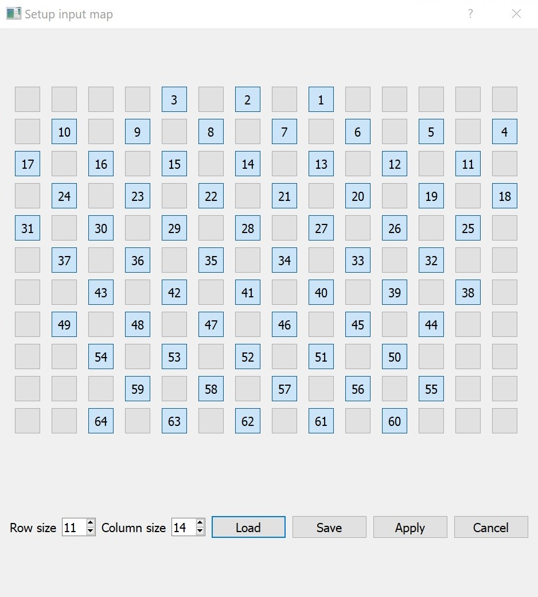
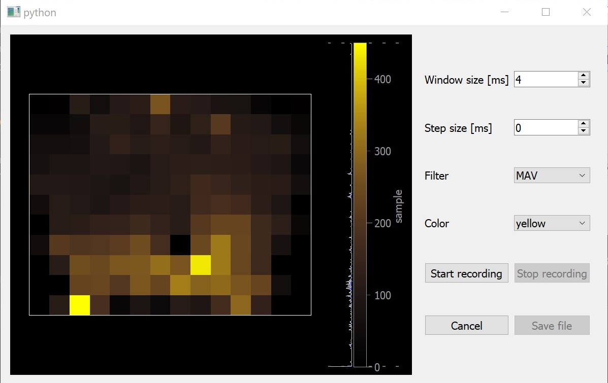

# Readme
## General Description
This is a realtime Heatplot EMG/EEG Datavisualizer. At the moment only Databases
can be used as data sources however it is possible to add other data
sources for future . Additional to the Heatmap a line plot and a spectrum plot was added.
##User Guide
###Installation
1. Click on the installer to install the programm at the current directory
2. Follow instructions of the installation wizard
3. Go to dist directory and execute main.exe

### Program
On the first window the user is asked to input the Database information
as well as the sample frequency and number of sensors. The user can then
choose the desired plot and click on create plot. Note that the Databases
must not be password protected.

#
If the user chooses the Heatmap another window pops up in order to choose
the arrangement of the sensors. There it is possible to save or load a configuration too.

#
Once the configuration is chosen the Heatmap plot appears

#
As an alternative one could also choose the Lineplot or Fourier plot to show either a channel with respect to time
or the spectrum of a channel. However note that at the moment the 2 different plots should NEVER
be chosen at the same time (Otherwise the program crashes). Before a second plot is opened the first has to be closed. In the futre this problem 
could be solved using multiprocessing.
